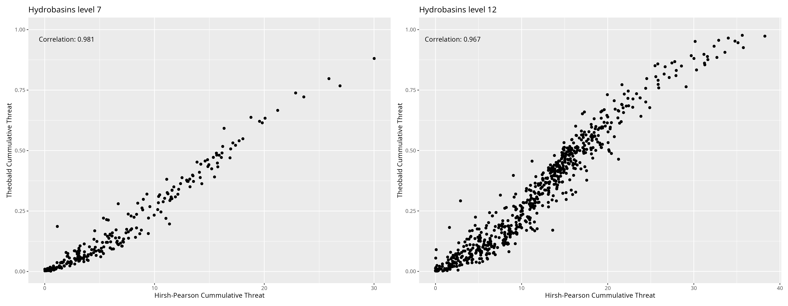

```{r setup, include = FALSE}
knitr::opts_chunk$set(
  collapse = TRUE,
  comment = "#>"
)
path_results <- function(filename) {
  fs::path_package("WaterQuality", "results", filename)
}
```

```{r call}
library(WaterQuality)
```


# Objective

Examine how water chemistry exceedances (values that are not within the range for the protection of aquatic life) varies with intensity of human activities.


# Data 

##  Water chemistry data

## Methods — Water chemistry data

### Data sources

References

Surface-water chemistry data were compiled from two national databases: **CICADA** and **DataStream**. DataStream records were downloaded for five Canadian regions (Pacific, Mackenzie, Lake Winnipeg, Great Lakes, and Atlantic) using the Explore Data → Custom Download tool, selecting lake/pond, river/stream, wetland, reservoir, and spring sites, and filtering to field-collected surface-water samples from 2015-2024. Variables included conductivity, dissolved chloride, dissolved oxygen, nitrate, pH, total dissolved solids, total phosphorus, turbidity, and several additional analytes.

CICADA data were obtained from the file *Nat_WQ_data_0_10_2023_v2.csv* and similarly filtered to samples from 2015 onward.


### Data harmonization and site identification

CICADA and DataStream datasets were reshaped to a common long format and merged after standardizing column names and adding a source (“Origin”) field. For DataStream, regional files were first combined, filtered to retain only consistent measurement units, and reduced to essential fields. Sites were identified using geographic coordinates; because identical coordinates were sometimes associated with different location IDs or regions, a unique coordinate-based site identifier was generated. Duplicate records (same site, date, variable, and value) occurring within or between datasets were removed, keeping one representative record.

After merging, a new harmonized site identifier (**LJ_Site_ID**) was created based on unique coordinates to ensure consistent site tracking across sources.


### Data cleaning

Implausible and erroneous values were removed prior to analysis. Thresholds for implausible concentrations were defined from expert consultation and literature (e.g., extreme values inconsistent with freshwater systems), and all negative values were excluded. This step eliminated values that were orders of magnitude beyond physically realistic ranges for freshwater chemistry.


### Filtering for CCME guideline compliance

To meet the minimum data requirements of the **Canadian Council of Ministers of the Environment (CCME)** guidelines for the protection of aquatic life, data were filtered so that each site-variable combination had:

1. **≥10 sampled days per year**, and
2. **≥3 years of data** (not necessarily consecutive) between 2015 and 2024.

Daily means were first calculated for each site, variable, and date to account for multiple samples taken on the same day. Sample days and months were counted for each site-variable-year combination, and sites not meeting the CCME minimum sampling density were excluded. Site-variable combinations with fewer than three total years of data were also removed.


### Temporal aggregation

Using daily means, additional temporal summaries were computed:

* **Monthly means and standard deviations** (mean of daily means within each month), and
* **Yearly means and standard deviations** (mean of daily means within each year).


### Water-quality thresholds

For each variable, daily, monthly, and yearly mean values were compared to guideline thresholds for the protection of aquatic life. Threshold exceedances were coded as binary indicators (1 = failed; 0 = passed). Thresholds were based on CCME guidelines where available, supplemented by peer-reviewed or government sources when CCME values were unavailable. Final thresholds used were:

| Variable               | Guideline    |
| ---------------------- | ------------ |
| Conductivity           | < 500 µS/cm  |
| Dissolved chloride     | < 120 mg/L   |
| Dissolved oxygen       | > 6.5 mg/L   |
| Nitrate                | < 3 mg NO₃/L |
| pH                     | 6.5-9.0      |
| Total phosphorus       | < 30 µg/L    |
| Total dissolved solids | < 500 mg/L   |
| Turbidity              | < 10 NTU     |

Variables that did not meet minimum data requirements (ammonia, nitrite, total suspended solids, and selenium) were excluded from the final dataset.

For each site-variable-year, the **proportion of failed days** was calculated as the fraction of daily means exceeding guideline thresholds.


### Final dataset

The cleaned, filtered, and aggregated dataset was exported as **WaterQuality2025.csv** and includes harmonized site identifiers, daily/monthly/yearly statistics, and CCME threshold exceedance metrics for the final set of water-quality variables. Below are the descriptions for each variable.

- **LJ_Site_ID** — Unique site identifier, based on coordinates; added after CICADA and DataStream data were merged and duplicates removed  
- **LATITUDE** — Latitude in decimal degrees  
- **LONGITUDE** — Longitude in decimal degrees  
- **Sample_date** — Date the sample was taken  
- **WC_variable** — Water chemistry variable measured (Conductivity, Dissolved_Chloride, Dissolved_Oxygen, Nitrate, pH, Total_Dissolved_Solids, Total_Phosphorous, Turbidity)  
- **Units** — Measurement units for the associated water chemistry value  

- **DD** — Day  
- **MM** — Month  
- **YYYY** — Year  

- **mean_day** — Mean daily value per site (average of multiple samples taken the same day, if applicable)  
- **sd_day** — Standard deviation of daily values per site (NA = one sample; 0 = identical multiple samples; >0 = differing samples)  

- **sample_days** — Number of sampled days per variable per site per year  
- **sample_months** — Number of sampled months per variable per site per year  
- **sample_years** — Number of sampled years per variable per site  

- **mean_month** — Mean of daily means for each month per variable per site  
- **sd_month** — Standard deviation of daily means for each month per variable per site  

- **mean_year** — Mean of daily means for each year per variable per site  
- **sd_year** — Standard deviation of daily means for each year per variable per site  

- **Thr_day** — Threshold result for daily mean (0 = pass, 1 = fail), based on CCME guidelines  
- **Thr_month** — Threshold result for monthly mean (0 = pass, 1 = fail), based on CCME guidelines  
- **Thr_year** — Threshold result for yearly mean (0 = pass, 1 = fail), based on CCME guidelines  

- **Prop_fail_year** — Proportion of days in a year that failed water-quality thresholds


## Human footprint datasets

Two human footprint datasets were used in the analysis. The first is the *Human Activities* dataset from @hirsh-pearson_CanadasHumanFootprint_2022, hereafter referred to as the “Hirsh-Pearson” dataset. The dataset is available on Borealis ([https://doi.org/10.5683/SP2/EVKAVL](https://doi.org/10.5683/SP2/EVKAVL)). The cumulative threat map included in this dataset represents the combination of twelve anthropogenic pressures (hereafter referred to as components).

The second dataset is the *Global Human Modification of Terrestrial Ecosystems (2022)* from @theobald_GlobalExtent_2025, available on Zenodo ([https://zenodo.org/records/14502573](https://zenodo.org/records/14502573)). We used the “AA” layer (all threats combined) and refer to this dataset as “Theobald.”

Both datasets are raster files. Values were extracted for hydrobasins defined by @lehner_GlobalRiver_2013, available from HydroSHEDS ([https://www.hydrosheds.org/products/hydrobasins](https://www.hydrosheds.org/products/hydrobasins)). We used HydroBASINS levels 7 and 12 for the analysis.

Correlation analyses between the two datasets yielded coefficients of 0.981 at level 7 and 0.967 at level 12. These high correlations indicate that either dataset can serve as a proxy for human footprint in DFO analyses, with minimal influence on overall conclusions.


```{R}

```


# Statistical Analysis

To examine the relationship between cumulative human footprint and water chemistry exceedances, we fitted generalized linear models (GLMs) with a binomial error distribution and a logit link function. We used the implementation of the function `glm()` available on the core package `stats` available in R version 4.5.2 [@r_v45]. Each model regressed a binary threshold exceedance indicator (pass/fail) against a scaled cumulative threat index. Exceedance indicators were evaluated at three temporal scales: daily, monthly, and yearly means. Explanatory variables were the Hirsh-Pearson and Theobald cumulative threat values extracted at HydroBASINS levels 7 and 12, standardized (centered and scaled) prior to model fitting.

Models were fitted for every combination of water chemistry parameter, cumulative threat index (four combinations of dataset x hydrobasin level), and temporal exceedance scale (daily, monthly, yearly), yielding a full factorial design. We applied the same modelling approach to examine the individual components of the Hirsh-Pearson dataset (e.g., forestry, mining, agriculture), replacing the cumulative threat index with each component as the sole explanatory variable. For each model we extracted the regression coefficient (effect size) on the logit scale, its profile-likelihood 95% confidence interval, the associated p-value, and the proportion of deviance explained (calculated as the reduction in deviance relative to the null model). Statistical significance was assessed at $\alpha$ = 0.001.


# Results 

Overall, we found similar patterns for both data at all scales, and all temporal and spatial scale.  


Results for components were less clear. 


```{R table_res_main}
path_results("res_main.csv") |>
  read.csv() |>
  dplyr::select(stressor, explanatory_var, response_var, expl_dev) |>
  dplyr::mutate(expl_dev = 100 * expl_dev) |>
  dplyr::arrange(stressor) |>
  knitr::kable()
```


# References 
